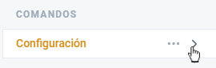

# Configuración

:gear: Estos son los comandos de configuración, asegúrate de expandir la categoría como se muestra en la imagen para verlos todos.

:gear: También puedes consultar esta lista de todos los comandos de configuración y hacer clic en ellos para ir a la página de comandos:

* [Export](export.md)
* [Import](import.md)
