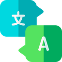

# Insignias

TutoPro tiene sus propias insignias que se muestran en el comando **user**. \
Se requiere estar en el [servidor de soporte](https://discord.gg/aUNhdFD) para que se muestren en tu perfil.

## Insignias del servidor de soporte

### Developer (Desarrollador)

Pertenece a las desarrolladores de TutoPro.&#x20;

### Head of Staff (Jefe de personal)&#x20;

Esta insignia se entrega al jefe del personal del servidor.

### Moderator (Moderador)

Otorgado a aquellos moderadores que mantienen seguro el servidor de soporte.

### Support Team (Equipo de soporte)

Dado a los usuarios que ayudan a resolver dudas sobre el bot.

### Helper (Ayudante)

Pertenece a aquellos usuarios que brindan ayuda general en el servidor de soporte.

## Insignias de TutoPro

### Partnered User (socio)

Esta insignia puede obtenerse si tienes un servidor asociado bajo tu administración.

### Premium User (Premium)

Los usuarios que administran un servidor premium obtienen esta insignia.

### Translator (Traductor)

Otorgado a los usuarios que contribuyen traduciendo el bot a diferentes idiomas.

### Beta Tester

No puedes obtener esta insignia (al menos por ahora). Solo aquellos que participaron en una etapa inicial de bot lo tienen.

> Íconos obtenidos de [https://www.flaticon.com/](https://www.flaticon.com/)
